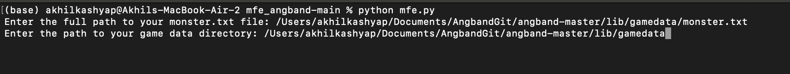
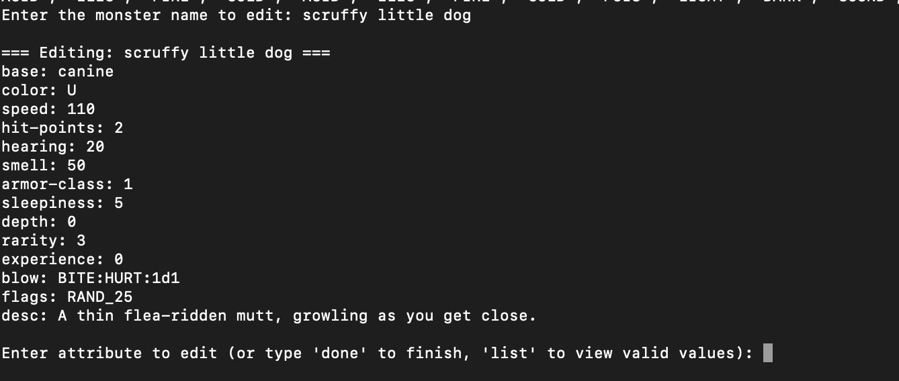
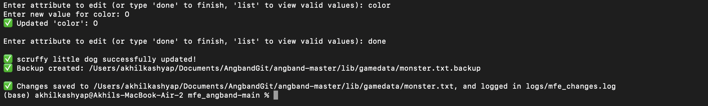

# Monster File Editor (MFE)

Monster File Editor (MFE) is a Python-based utility designed to allow easy editing of monster attributes in the Angband game's monster files. This tool provides a user-friendly, command-line interface to modify attributes such as color, speed, health, and more directly within the `monster.txt` file. The program ensures that changes are saved correctly and that any dependencies required from the `gamedata` directory are properly handled.

---

Man File can be found in the man/mfe.1 and can be run using command 

   ```bash
   man ./mfe.1
   ```

---

## Installation Steps

1. Open the following link on GitHub: [Monster File Editor Repository](https://github.iu.edu/nsavale/mfe_angband)

2. Click on the green **“Code”** button and download the ZIP file.

3. After downloading, unzip the file.

4. Ensure you have **Python 3** installed on your system.  
   You can download Python 3 from: [https://www.python.org/downloads/](https://www.python.org/downloads/)

5. Open **Terminal** (on macOS/Linux) or **Command Prompt** (on Windows).

6. Use `cd` to navigate into the directory where you unzipped the files.

7. Run the following command:
    ```bash
    python3 mfe.py
    ```
8. The program will now start running.

---

## Running the Program

1. After running the program, it will prompt you for the path to the **`monster.txt`** file.

2. Next, it will ask for the path to the **gamedata** directory.  
   This helps ensure any required dependencies are correctly installed.

3. The program will then ask for the name of the monster you want to edit.

4. Once you enter the monster's name, it will display all attributes for all monsters.

5. Type the attribute you want to change.

6. Enter the new value for that attribute.

7. After editing, the program will ask if you want to edit anything else.  
   You can either continue or type **Done** to terminate the program.

---

## Example: Running the Program

**Scenario:**  
You want to change the color of the **"scruffy little dog"** because you want the dog to be pink.

### Step 1: Start the program and follow the prompts.



---

### Step 2: Enter the monster name and see the attributes.



---

### Step 3: Select the attribute, provide the new value, and finalize.



---

## Notes

- Ensure `monster.txt` and `gamedata` are in correct locations and contain valid data.
- The program supports editing multiple attributes until you type **Done**.

---

## License

This project is open-source. Feel free to modify and improve.

---

## Contributors

- TEAM 20 
- Sierra Napieralski
- Hannah Lengacher
- Akhil Kashyap
- Bryan Akin
- Nileet Savale
